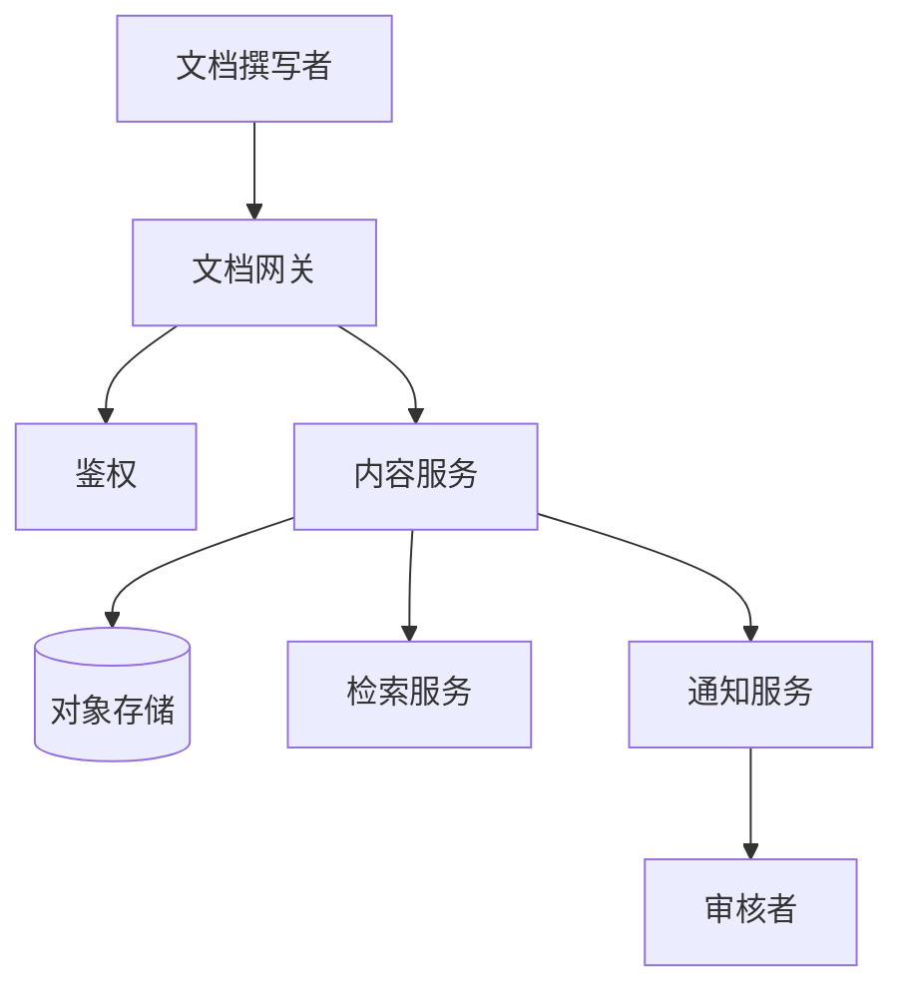
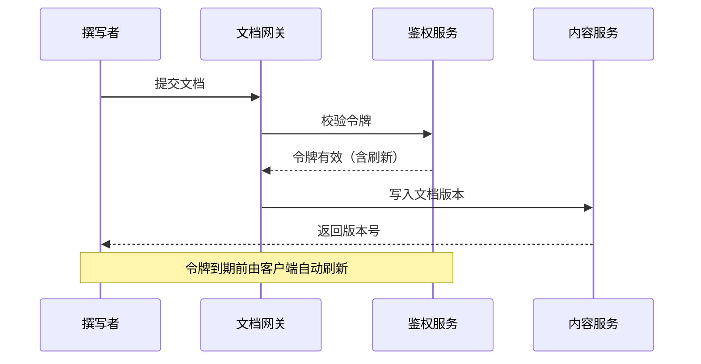

# 系统架构总览

本文描述示例文档平台的整体架构、组件职责与关键请求时序，供撰写者与审核者快速建立全局认知。

## 1. 组件拓扑

系统由以下组件构成：

- **文档网关（Gateway）**：接收外部读写请求，负责鉴权与限流。
- **内容服务（Content Service）**：管理 Markdown 文档的存储与版本。
- **检索服务（Search Service）**：提供全文检索与标签过滤。
- **对象存储（Object Store）**：存放图片、SVG 等二进制资产。
- **通知服务（Notify）**：在文档变更后推送审核消息。

## 2. 请求时序（登录到令牌刷新）

## 3. 部署形态

所有组件以容器方式部署，网关前置并暴露公网，内容 / 检索 / 通知服务位于内网网段。
